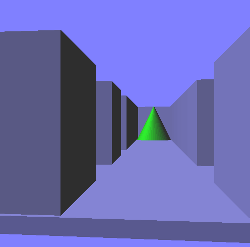

**Hunters Maze Game**

**Portfolio Project**

**Introduction**
Hunters Maze Game is a simple program that makes random maze using opengl api with C++ language. The Hunters Maze Game is meant to provide a seamless and engaging gameplay experience, creating a maze game requires many critical technological and architectural concerns. There is a top-down shooter where the player’s objective is to survive waves of enemies. You want to create an enemy AI behavior that presents a significant challenge to players.
The links shown below furnish a more in-depth insight on the Hunters Maze Game.
Deployed site and landing page
(http:// Frazier-Creation.github.io), (https:// Frazier-Creation.github.io/Frazier-Creation.io)
(http://SilGithinji.github.io), (https://SilGithinji.github.io/SilGithinji.github.io)

**Authors LinkedIn**
Frazier Omondi: https://www.linkedin.com/in/frazier-omondi-742534b7/
Isaac Githinji: https://www.linkedin.com/in/silvester-muriithi-57499b1aa/

**Installation**
•	Windows
o	Required ... To Run This Program In Windows You Can Use The Codeblock IDE (Get Here) After That Follow The Instructions The Installation With The Addition Of The Opengl Api (Learn Here).
o	How To Run :
o	- Create A New Project Glut/Opengl Project
o	- Just Copy Paste The Code In Your main.Cpp Has Been Made

•	Linux
o	You Can Use The Codeblock For Linux As Well.
o	You Can Execute Your Code Using A Text Editor That You Love. Like Atoms, Sublime,Geany Or Another.
Before Executing, You Must Install Some Dependenci Of Glut On Linux. What You Need To Do Is (Installation Via Terminal):
o	Install The Compiler And Necessary Tools.A Fairly Complete Compiler You Can Use G++, How to :
sudo apt-get install g++ cmake 
o	Install Freeglut :
sudo apt-get install freeglut3 freeglut3-dev
o	Run Using Terminal :
gcc -o excecutebin filename.cpp -lglut -lGL -lm -lGLU -lstdc++

**Usage**
•	Kruskal Algorithm
Kruskal’s algorithm is a method for producing a minimal spanning tree from a weighted graph. The algorithm I’ll cover here is actually a randomized version of Kruskal’s; the original works something like this:
o	Throw all of the edges in the graph into a big burlap sack. (Or, you know, a set or something.)
o	Pull out the edge with the lowest weight. If the edge connects two disjoint trees, join the trees. Otherwise, throw that edge away.
o	Repeat until there are no more edges left. 
•	Maze Feature
o	Generate new layout "C"
o	Change Object player "P"
o	Change view "V" (2 Dimension, 3 Dimension, Fps)
o	Move the player Up:"W" | Down:"S" | Left:"A" | Right:"D"
o	Rotate maze -YAxis:"J" | -XAxis:"K" | XAxis:"I" | XAxis:"L" (Only In 3dimension)
o	Action For Key --> 1,2,3,4,5
	Key 1 -> Active/Deactive Ambient Light
	Key 2 -> Active/Deactive Diffuse Light
	Key 3 -> Active/Deactive Specular Light
	Key 4 -> Change The Day (Background)
	Key 5 -> Change Wall Transparant or Not
o	Change Maze size , "+" to Increase and "-" to Decrease
o	Arroy Key To Walk Inside Maze While in Fps Mode (ArrowKeyUP , ArrowKeyDOWN , ArrowKeyLEFT, ArrowKeyRIGHT)
o	Change Nim (ID) Rotation Using Mouse Click (Left,Center,Right)
o	Space to Run/Stop another one player.

**Contributing**
At first, we were not certain on what we could indulge with for the project. After the project was released, we decided that we would do what seemed impossible by working on the maze project. We desired to transform it into a story that suited our theme of using ALX as an opportunity to refine our developing skills to suit the modern market needs. Hunters Maze Game was birthed out of a desire to take on an existing challenge and explore an existing option that would make it better.
Three essential milestones were measured progressively. Milestone one which commenced in August and ended in two weeks entailed developing an introduction with a focus on the overview of the maze application and this enabled us to highlight the desired outcomes and achievements. It also allowed is to adequately plan through a progressive recap of scope and objectives against the set responsibilities and resources.
Milestone two commenced in mid-August and was also assessed after two weeks. It entailed Collaboration and communication entailed a progressive evaluation of tools and channels used in the development of the project with regards to how our regular team meetings and updates facilitated progress. The outcome of the introductory and collaboration efforts resulted in a refined overview of the maze concept and design which led to prototyping and testing stages to understand the iterative design process and its impact on the final maze.
Milestone three commenced in September and was evaluated after two weeks. It entailed using C++ to physically and digitally test the maze project which enabled progressive monitoring leading to the final testing, documentation and validation stages.
Below are some screenshots of the maze project at work.

**Documentation**

•	V-1.0
o	In This Version, The Object The Player Can Still Penetrate The Wall
o	Object Player Running (Right, Left, Bottom, Top) With Magnitude 0.1.
o	The Shape Of The Maze Randomed By Using Button C & Player Can Walk A = Left, S = Down, D = To, W = Up
o	Still 2 Dimensional Maze Form

•	V-2.0
o	Object cant penetrate the wall
o	Have two object player (cube and cone)
o	Have 2 different view, 2d and 3d
o	When 3dviewmode, maze can rotation by I,J,K,L
o	Nim rotation can change by mouse click (left,center,right)
o	Change maze size using "+" to increase and "-" to decrease

•	V-3.0
o	Have 3 different view, 2d, 3d, Fps
o	Can walk inside the maze using arrowKey when fps viewmode
o	Active / Deactive 3 Light usign 1,2,3 Key
o	Tranparant Wall usign the 5 Key
o	Day or Night usign the 4 key
o	Spaace to Run/Stop another one player.

**License**

Copyright (c) 2023 Frazier Omondi and Isaac Githinji

Permission is hereby granted, free of charge, to any person obtaining a copy of this software and associated documentation files (the "Software"), to deal in the Software without restriction, including without limitation the rights to use, copy, modify, merge, publish, distribute, sublicense, and/or sell copies of the Software, and to permit persons to whom the Software is furnished to do so, subject to the following conditions:
The above copyright notice and this permission notice shall be included in all copies or substantial portions of the Software.

THE SOFTWARE IS PROVIDED "AS IS", WITHOUT WARRANTY OF ANY KIND, EXPRESS OR IMPLIED, INCLUDING BUT NOT LIMITED TO THE WARRANTIES OF MERCHANTABILITY, FITNESS FOR A PARTICULAR PURPOSE AND NONINFRINGEMENT. IN NO EVENT SHALL THE AUTHORS OR COPYRIGHT HOLDERS BE LIABLE FOR ANY CLAIM, DAMAGES OR OTHER LIABILITY, WHETHER IN AN ACTION OF CONTRACT, TORT OR OTHERWISE, ARISING FROM, OUT OF OR IN CONNECTION WITH THE SOFTWARE OR THE USE OR OTHER DEALINGS IN THE SOFTWARE.
